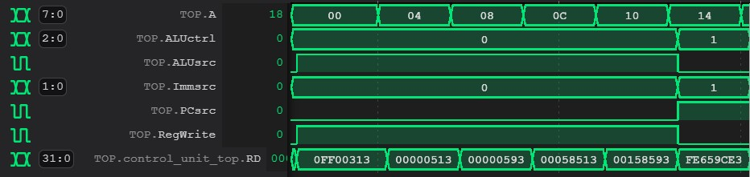

# Logbook: Control Unit & Orthers

## Basic Info

* Author: Qidong Zhou
* Date: 26 NOV 2022
* Objectives: 
    * create a control unit that produces control signals for multiplexers, ALU etc.
    * create an instruction memory.
    * create a signed extension that converts a 12-bit input to a 32-bit output.

## Results

**1. Instruction memory**

This component is a 2^8 addresses ROM with each address stroes a 32 bits instruction.

**2. Signed Extension**

The signed extension of immediate is based on the Immsrc input from the control unit. The component concatenates 20 bits of the most significant bit with a 12 bits immediate(depend on Immsrc) to produce a 32 bits ouput. 

**3. Control Unit**

### addi operation
the addi operation add a imm and data in a register together and then store to a register in register file. See fisrt four cycles in Figure 1 and Table below.

### bne & beq operation
the bne(branch not equal) and beq(branch equal) branch the program depending on whether imm and data in a register are the same. EQ is the output from ALU and produce 1 when two values are equal. See the fifith cycle in Figure 1 and Table below.

|Operation|ALUctrl|ALUsrc|Immsrc|PCsrc|RegWrite|
|---------|-------|------|------|-----|--------|
|addi|000|1|insrt[31]|0|0|
|bne|001|1|instr[31]|~EQ|0|
|bqe|001|1|instr[31]|EQ|0|

||
|:--:|
|Figure 1 : control unit test|