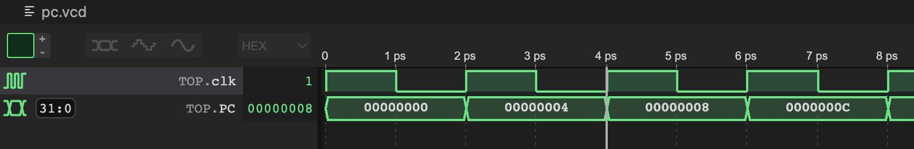
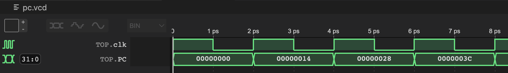

# Logbook: Program Counter

## Basic Info

* Author: Samuel Wang
* Date: 25 Nov 2022
* Objective:
  * Create a program counter register.
  * Create a program counter that accepts controls signals from the control unit and adjusts the output accordingly.

## Result

The program counter is quite a simple component. The component was testing in two ways. Both behaved as expected, see simulation result below.

**Test 1: Branch Operation**

Testbench:
* `PCsrc = 1`
* `ImmOp = 0`

Output program counter steadily increases by 4 every cycle. Behaves as expected. See Figure 1.

|  |
|:--:|
| Figure 1: Program Counter Branch Test |

**Test 2: Normal Operation**

Testbench:
* `PCsrc = 0`
* `ImmOp = 20`

Output program counter steadily increases by 20 (0x14) every cycle. Behaves as expected. See Figure 2 for simulation result.

|  |
|:--:|
| Figure 2: Program Counter Normal Test |